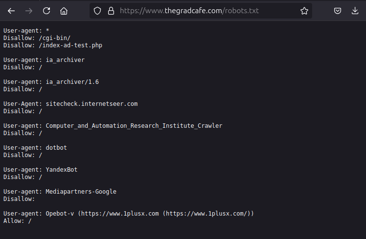
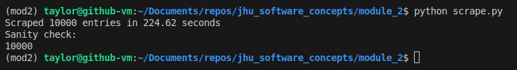
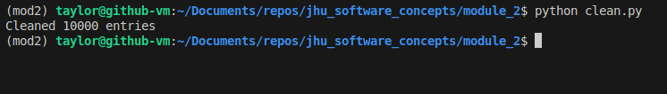
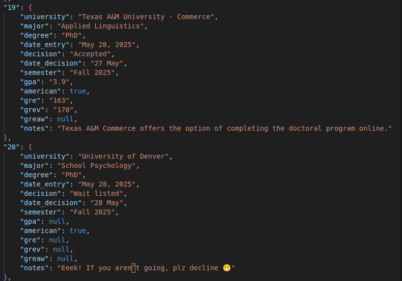

# Module 2

## Author
Taylor J. Reininger\
trinin2@jh.edu\
EN.605.256\
2025-06-01

[Submission Link]()

## Web Scraping Assignment

From the homework instructions:

**"This assignment is pracing scraping data from websites. The site [grad cafe](https://www.thegradcafe.com/) allows people to upload information about programs they have been accepted / rejected / waitlisted from and basic applicant informaton, including date, start term, degree, program, and academic performance metrics. In this assignment, student developers (you!) are going to gather a copy of those freely uploaded student metrics and save it to be used in future requirements.
This will require you to manipulate urls, control HTML objects, and search within the structured data
using several of the string methods taught in class this week. Your resultant output should clean
dictonaries of informaton covering 1000nds of student’s graduate school acceptance statistics – all
ready to be analyzed in future assignments!"**

Due 2025-06-01.

## Legal

To ensure we are authorized to scrape the grad cafe website, we first check the ```robots.txt``` file. 

\
Screenshot taken on 2025-05-30

This file was also downloaded directly into this module [here](robots.txt)

There is no restriction preventing us from using ```urllib``` and ```BeautifulSoup``` to scrape this website as long as we don't scrape ```/cgi-bin/``` or ```/index-ad-test.php```. 


## Approach

- I am using Python==3.12
- I am using BeautifulSoup4 as our webscraping framework
- I am using Urllib for HTML collection
- I am using JSON to save and load the cleaned data

The ```scrape.py``` script implements the ```Scrape``` class to scrape at least ```n``` entries from the grad cafe website. It will scrape as many pages as it needs to to meet or exceed the number ```n```. ```n``` is specified in the ```main``` routine of this script, and is defaulted to 10,000. The data is then pickled off in an uncleaned list of content to be used later. 

The ```clean.py``` script implements the ```Clean``` class to process the data we scraped in the previous step. This is done by loading in the uncleaned pickle file, using string manipulation and ```regex``` to find the fields of interest and format them correctly. This data is stored in a dictionary that is then written to a ```.json``` file on the disk. The class can also load in content from a ```.json``` file that already exists. 


## Installation and Execution

NOTE: These instructions assume the user either has Anaconda or another method of creating virtual environments already configured. 

Follow these steps to configure and execut the web app:

1. Create your virtual environment (Anaconda or Pyenv)
```bash
## Anaconda

# Create new Anaconda environment based on Python 3.12 (enter "y" to continue)
conda create -n mod2 python==3.12

# Activate the newly created environment 
conda activate mod2
```

((OR))

```bash
## Pyenv

# Install the latest version of Python 12 for pyenv
pyenv install 3.12.10

# Activate this version of pyenv for use in the next step
pyenv shell 3.12.10

# Create the virtual environment
python -m venv mod2

# Activate the newly created environment
source ./mod2/bin/activate

# Update pip just in case it's on an old version
pip install --upgrade pip
```

2. Navigate to the ```module_2``` folder of this repo
3. Install the dependencies for the app
```bash
# Install all the libraries in the requirements file
pip install -r requirements.txt
```

4. Run the scrape script with the default 10k entries parameter and default file names. 
```bash
python scrape.py
```

The output should looks something like this:


On my computer, this is scraping about 2700 entries a minute.


5. Run the clean script with the default file names. 
```bash
python clean.py
```




A screenshot of the resulting ```.json``` file can be seen here:





The full ```.json``` file can be accessed [here](application_data.json)


## Known Issues

- If a user enters a new admission result while scraping, this will result in a redundant entry on the next page scraped, as the entries will shift down one. 
- There are some blank lines in the grad cafe table, this has been handled in the simplest way, but may not be robust
- Comments can have interesting anomolies like emojis and special symbols that come out weird in the JSON. This has been handled with ```ensure_ascii=False```. Hopefully the downsides of this are minimal. 


## Resources and Citations

- The [Grad Cafe](https://www.thegradcafe.com/) itself for all the data. 
- I found the Python documentation for [regex](https://docs.python.org/2/library/re.html#re.search) to be helpful
- I found this [Stack Overflow thread](https://stackoverflow.com/questions/5041008/how-to-find-elements-by-class) to be really helpful in learning to use BeautifulSoup objects to identify content of a particular HTML class. 