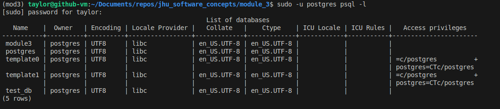
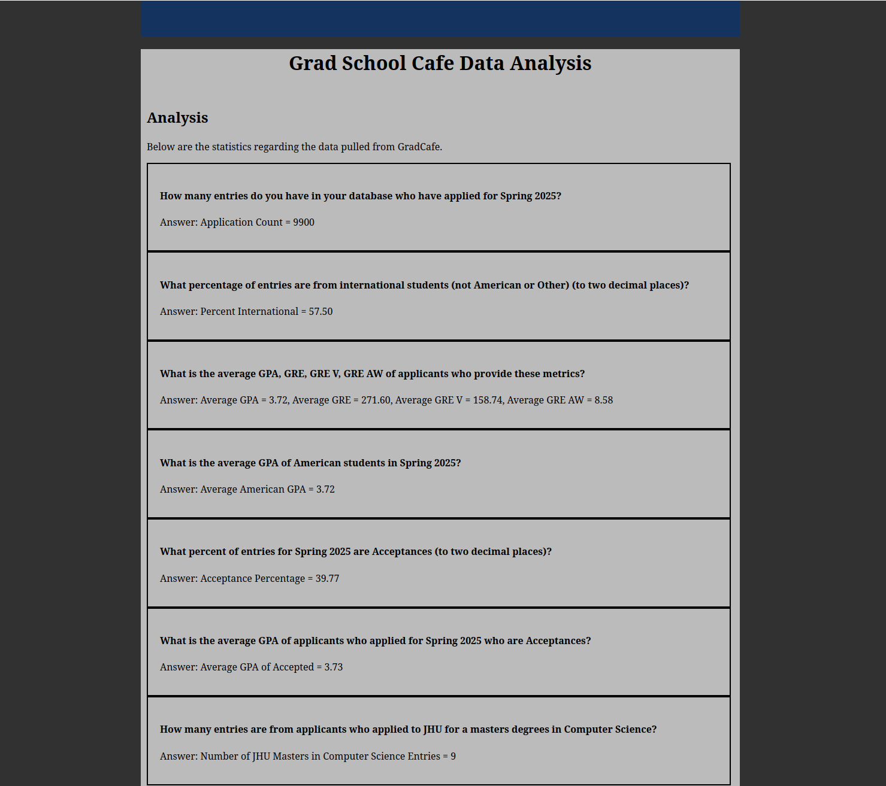

# Module 3

## Author
Taylor J. Reininger\
trinin2@jh.edu\
EN.605.256\
2025-06-08

[Link to GitHub module](https://github.com/TaylorReininger/jhu_software_concepts/tree/main/module_3)

## Approach

- I am using Python==3.12
- I am using Flask as my framework for the web app
- I am using Psycopg as my PostgreSQL database interface


The ```load_data.py``` script takes all the data scraped from the web in a ```.json``` format and loads it into a PostgreSQL database. The ```query_data.py``` file implements the ```QueryData``` class which allows us to get specific statistics from the database. The ```app.py``` script starts the webapp and uses the ```QueryData``` class to populate the web app with statistics. 


## Installation and Execution

NOTE: These instructions assume the user either has Anaconda or another method of creating virtual environments already configured. 

Follow these steps to configure and execut the web app:

1. Create your virtual environment (Anaconda or Pyenv)
```bash
## Anaconda

# Create new Anaconda environment based on Python 3.12 (enter "y" to continue)
conda create -n mod3 python==3.12

# Activate the newly created environment 
conda activate mod3
```

((OR))

```bash
## Pyenv

# Install the latest version of Python 12 for pyenv
pyenv install 3.12.10

# Activate this version of pyenv for use in the next step
pyenv shell 3.12.10

# Create the virtual environment
python -m venv mod3

# Activate the newly created environment
source ./mod3/bin/activate

# Update pip just in case it's on an old version
pip install --upgrade pip
```

2. Navigate to the ```module_3``` folder of this repo
3. Install the dependencies for the app
```bash
# Install all the libraries in the requirements file
pip install -r requirements.txt
```

4. Create or identify the database of interest by interacting directly with the postgresql server on your operating system. 
```bash
sudo -u postgres psql module3   # Note1: the user is set to postgres. 
                                # Note2: replace module3 with your desired name if not using the default
```

You can check that the database exists like this:




5. Open the ```load_data.py``` script and change the ```name_db``` to the desired value (default is ```module3```)
```bash
python load_data.py
```

6. Run the ```app.py``` file to open the web app and see the data
```bash
python app.py
```

7. Open the web app by navigating your browser to the URL printed in the terminal
```bash
# Example URL
http://127.0.0.1:8080
```




## Essay

My essay questions can be found here:

[Essay PDF](limitations.pdf)


## Module 2 Changes

- Had to go back to Module 2 and make sure to also capture the link to the insticator commenting page. 
- Had to shift some of the column indexing to account for the new field in the cleaning script. 
- Had to re-scrape the data and re-clean it. 
- Made a copy of the new dataset into module_3 for use with this homework. 


## Limitations

- I'm choosing to fill blank fields with -1 so they can still be floats.
- GPA scales are different (some out of 4, some higher).
- Things like emojis, seeing GPAs with no decimal like "3 99" and other nonsense are challenging.
- Could potentially see malicious database injection code in the entries.


## Citations

- I found Llama3.1 extremely helpful with this homework.
- I used this psycopg website for help with parameterized SQL queries: [link](https://www.psycopg.org/psycopg3/docs/basic/params.html)
- I borrowed heavily from my module_1 web app.
- I used data scraped and cleaned from module_2, but did have to re-scrape and clean the data.

