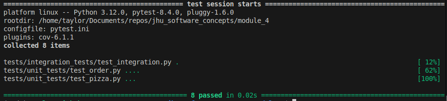
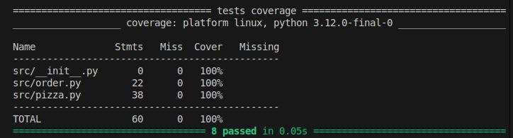
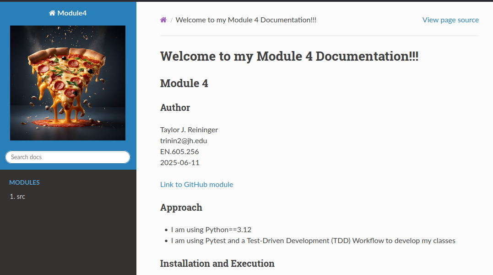

# Module 4

## Author
Taylor J. Reininger\
trinin2@jh.edu\
EN.605.256\
2025-06-11

[Link to GitHub module](https://github.com/TaylorReininger/jhu_software_concepts/tree/main/module_4)

## Approach

- I am using Python==3.12
- I am using Pytest and a Test-Driven Development (TDD) Workflow to develop my classes


## Installation and Execution

NOTE: These instructions assume the user either has Anaconda or another method of creating virtual environments already configured. 

Follow these steps to configure and execut the tool:

1. Create your virtual environment (Anaconda or Pyenv)
```bash
## Anaconda

# Create new Anaconda environment based on Python 3.12 (enter "y" to continue)
conda create -n mod4 python==3.12

# Activate the newly created environment 
conda activate mod4
```

((OR))

```bash
## Pyenv

# Install the latest version of Python 12 for pyenv
pyenv install 3.12.10

# Activate this version of pyenv for use in the next step
pyenv shell 3.12.10

# Create the virtual environment
python -m venv mod4

# Activate the newly created environment
source ./mod4/bin/activate

# Update pip just in case it's on an old version
pip install --upgrade pip
```

2. Navigate to the ```module_4``` folder of this repo

3. Install the dependencies for the app
```bash
# Install all the libraries in the requirements file
pip install -r requirements.txt
```

4. To run the pytest test suite on our code, run the following:
```bash
# Run all tests
pytest .

# Run the tests with the "order" mark
pytest -m order
# Run the tests with the "pizza" mark
pytest -m pizza
```
Example output:




5. Run code coverage report
```bash
# Creates a coverage report for the folder "src"
pytest --cov-report term-missing --cov=src
```
Example output:




6. To run the Sphinx documentation process
```bash
# Navigate to the documentation folder
cd docs
# Run the auto-documentation step
sphinx-apidoc -o ./source ../src/
# Clean and build the HTML
make clean
make html
```

7. To open the documentation, open the ```index.html``` file in ```docs/build/html```

Sample HTML

